# Getting started with Obsidian-Flavored Markdown

The Obsidian-Flavored Markdown (OFM) is a Superset of Markdown. While it supports all standard syntax of the [**CommonMark**](https://commonmark.org/) (the strict Markdown Standard) and the [**GitHub-Flavored Markdown**](https://github.github.com/gfm/) (GFM), it also introduces several "non-standard" extensions designed for networked thought and personal knowledge management.  

Here's a review of the most common Markdown elements you'll be using while working on Obsidian documents.
## Markdown Syntax

Markdown syntax is generally divided into two main categories block-level elements affecting entire paragraphs, and in-line elements appearing within a line without enforcing a new block. 

### In-line Markups

Markdown uses **Inline delimiters** to mark the beginning and end of a specific unit data. These units, often referred to as spans, allow for the modification of text style or the injection of functional metadata without breaking the flow of the paragraph. Unlike block-level elements, inline delimiters require symmetrical enclosure (wrapping the text) to be recognized by the parser. 

As of 2026, the core CommonMark specification ([version 0.31.2](https://spec.commonmark.org/0.31.2/)) includes the following standard inline elements:
#### Standard CommonMark Inlines

- **Emphasis (Italics):** Wrap text in single asterisks `*text*` or underscores `_text_`.
- **Strong Emphasis (Bold):** Wrap text in double asterisks `**text**` or double underscores `__text__`.
- **Inline Code (Code Spans):** Use backticks to delimit code fragments, such as `` `code` ``. Use double backticks if the code itself contains a backtick.
- **Links:**
    - **Inline:** `[Link Text](URL "Optional Title")`.
    - **Reference:** `[Link Text][id]` with a matching definition `[id]: URL` elsewhere.
    - **Autolinks:** Enclose a URL in angle brackets, like `<https://example.com>`.
- **Images:** Use an exclamation mark followed by link syntax: ``.
- **Raw HTML:** Inline HTML tags (like `<span>` or `<a>`) are passed through if they are valid open or closing tags.
- **Hard Line Breaks:** Created by ending a line with two or more spaces followed by a newline, or a backslash `\` followed by a newline.
- **Backslash Escapes:** Use `\` before a special character (e.g., `\*`) to render it literally instead of as markup.

#### Common Extensions (Non-Standard)

While not part of the base CommonMark spec, many 2026 implementations (like [GFM](https://github.github.com/gfm/)) include these as "inlines": 

- **Strikethrough:** Double tildes `~~text~~`.
- **Task Lists:** `[ ]` or `[x]` inside list items.

#### Core Obsidian Inlines
Obsidian-Flavored Markdown (OFM) extends CommonMark with specific inline markups designed for personal knowledge management and note linking. As of 2026, the key specific inlines are:

- **Wikilinks:** Use double square brackets `[[Note Name]]` to create internal links between files.
    - **Aliases:** Use a pipe to add display text: `[[Note Name|Display Text]]`.
    - **Heading Links:** Link directly to a section with `[[Note Name#Heading]]`.
    - **Block Links:** Link to a specific block using a caret and unique ID: `[[Note Name#^block-id]]`.
- **Highlighting:** Use double equals signs `==text==` to highlight text.
- **Embeds (Transclusion):** Add an exclamation mark before a Wikilink `![[Note Name]]` to display the content of that note or image directly within the current note.
- **Inline Math:** Uses LaTeX syntax wrapped in single dollar signs `$e^{2i\pi} = 1$` for mathematical expressions.
- **Comments:** Use `%%text%%` to create comments that are visible in the editor but hidden in Reading mode.

### Block-level elements
Block-level elements represent structural units that occupy the full width of their 'container' and always start on a new line. As of 2026, OFM supports the standard CommonMark blocks and several specialized extensions.
#### Core CommonMark Blocks
These are the standard structural elements found in most Markdown environments:

* **Headings** commonly denoted using **hashed-based** syntax (ATX Headers), where heading levels are determined by the **number** of hashes (`#`) at the beginning of a new line, followed by a space:

``` Markdown
# Heading 1
## Heading 2
### Heading 3
#### Heading 4
##### Heading 5
###### Heading 6 <!--Up to 6 heading levels supported-->
```

While less common, Setext-style headings are also supported (only levels 1 and 2): 

```Markdown
Heading 1  
=========

Heading 2  
---------
```
- **Lists:**
    - **Unordered:** Using `-`, `*`, or `+`.
    - **Ordered:** Using numbers followed by a period or parenthesis (e.g., `1.` or `1)`).

```Markdown
- Bullet item 1 
- Bullet item 2
	- Nested item (reads indent)
- Bullet item 3

1. Number one
2. Number two 
3. Number three
```

- **Code Blocks:** Enclosed by triple backticks (` ``` `) or tildes (`~~~`). You can add a language identifier (e.g., ` ```python `) for syntax highlighting.
```Markdown
	```Python
	def greet(name: str)->None:
		print(f"Hello, {name}!")
	```
```

- **Blockquotes:** Created by starting a line with `>`. They can be nested within each other.
- **Horizontal Rules:** Three or more `***`, `---`, or `___` on their own line. 
#### Obsidian-Specific Block Elements

Obsidian adds unique block-level capabilities for personal knowledge management: 

- **Callouts:** A highly stylized blockquote extension. The syntax is `> [!type]` on the first line (e.g., `> [!info]`). These can be made **collapsible** by adding a plus `> [!info]+` or minus `> [!info]-` sign.

Here are the supported callout keywords in Obsidian, grouped by their semantic purpose:

+ Information & General

| Keyword                       | Icon                   | Color |
| ----------------------------- | ---------------------- | ----- |
| `[!info]`                     | Info (Circle with 'i') | Blue  |
| `[!note]`                     | Pencil                 | Blue  |
| `[!todo]`                     | Checkbox               | Blue  |
| `[!abstract]` or `[!summary]` | Clipboard/List         | Cyan  |

+ Attention & Warnings

| Keyword                                        | Icon                 | Color  |
| ---------------------------------------------- | -------------------- | ------ |
| `[!tip]` or `[!hint]` or `[!important]`        | Flame                | Green  |
| `[!success]` or `[!check]` or `[!done]`        | Checkmark            | Green  |
| `[!question]` or `[!help]` or `[!faq]`         | Question Mark        | Orange |
| `[!warning]` or `[!caution]` or `[!attention]` | Triangle Exclamation | Orange |
| `[!failure]` or `[!fail]` or `[!missing]`      | X Mark               | Red    |
| `[!danger]` or `[!error]`                      | Lightning Bolt       | Red    |
| `[!bug]`                                       | Bug                  | Red    |

+ Reference & Content

| Keyword                 | Icon               | Color  |
| ----------------------- | ------------------ | ------ |
| `[!example]`            | List/Bullet Points | Violet |
| `[!quote]` or `[!cite]` | Quotation Marks    | Grey   |

- **Task Lists:** Unordered list items starting with `[ ]` for incomplete and `[x]` for completed tasks.

```Markdown
	- [x] to-do task 1
	- [x] to-do task 2
	- [ ] to-do task 3
```

- **Frontmatter (YAML Properties):** A block at the very top of a note delimited by triple dashes `---` that stores document metadata.
- **Bases (Native Tables):** A 2025/2026 core feature that allows for database-like table blocks, replacing the need for external plugins like Dataview for many users.
- **Block Identifiers:** You can add a unique ID to any block by placing `^block-id` at the end of it, allowing you to link directly to that specific block from other notes.^block-1
- **Footnotes:** A specialized block defined at the bottom of a note using `[^1]: My note text`.

- **Math and Diagrams**: Obsidian includes native support for specialized rendering engines that are common in technical documentation but technically "extensions":
	- **LaTex**: Supports math blocks via `$...$` and `$$...$$`
	- **Mermaid**: Supports diagrams within code blocks: 
	
## Diagrams
https://www.youtube.com/watch?v=rXhUeV5Ko7g&list=PLSWNAxJuTT5HZN_kTsR_mrUKtJvfqTQmc
### Pie Charts
```Markdown
	```mermaid
# Pie chart
pie title Users
"Mobile": 55.9
"Desktop": 40.1
"Tablet": 4
	```
```

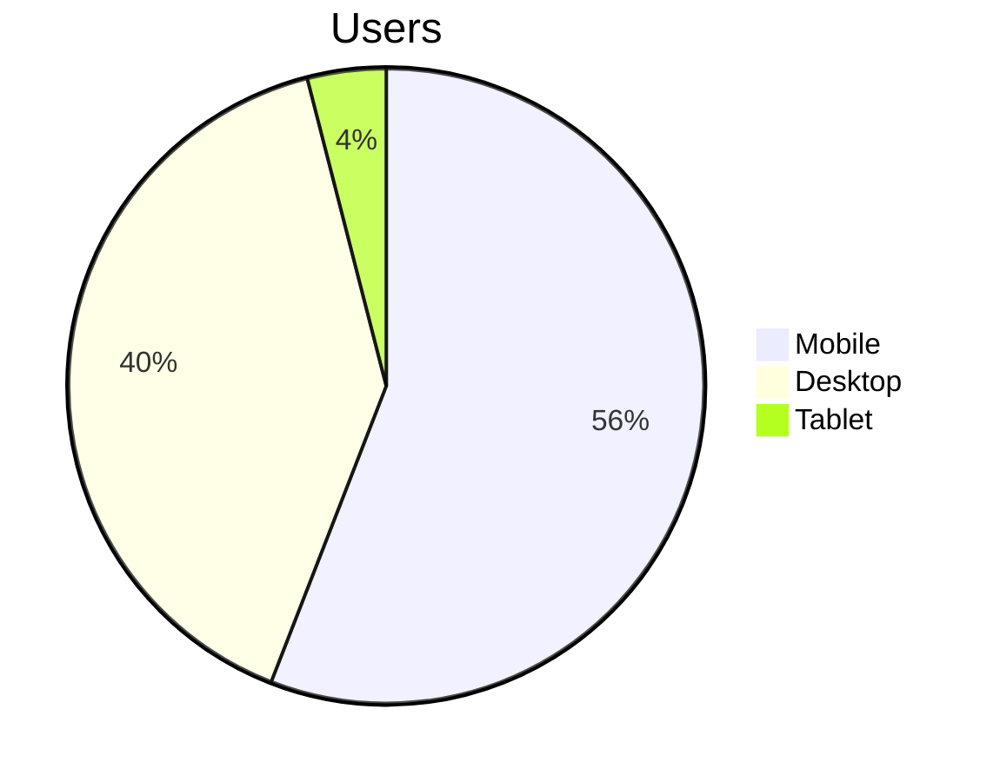


### Direction

1. Top to Bottom
```Markdown
	```mermaid
	graph TB
	A-->B
	```
```
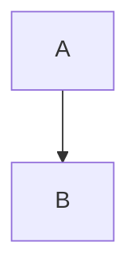

2. Bottom to top
```Markdown
	```mermaid
	graph BT
	A-->B
	```
```

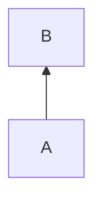

3. Left to Right
```Markdown
	```mermaid
	graph LR
	A-->B
	```
```

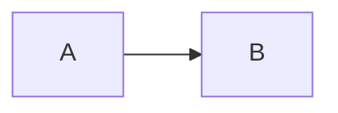

4. Right to Left

```Markdown
	```mermaid
	graph RL
	A-->B
	```
```
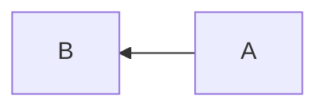

### Shapes
1. Normal Box
```Markdown
	```mermaid
	graph TD
	boxa[ Normal Box with text ]
	```
```

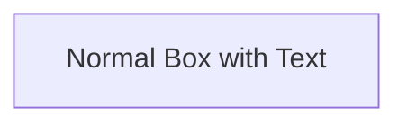

2. Pill Shaded Box
```Markdown
	```mermaid
	graph TD
	boxa([ Normal Box with Text ])
	```
```

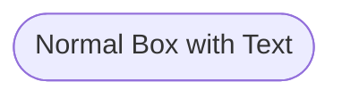

3. Box with Rounded Edges
```Markdown
	```mermaid
	graph TD
	boxa(Normal Box with Text)
	```
```

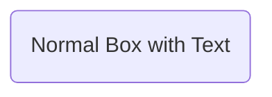

4. Subroutine shaped-box
```Markdown
	```mermaid
	graph TD
	boxa[[normal box with text]]
	```
```

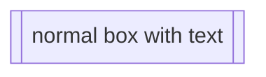
5. Cylindrical shape
```Markdown
	```mermaid
	graph TD
	boxa[( text box )]
	```
```
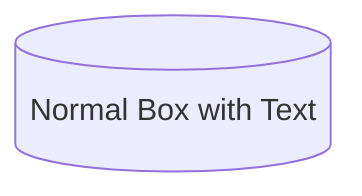

```Markdown
	```mermaid
	graph LR
	boxa[(Database A)]-->boxb[Database B]
	```
```
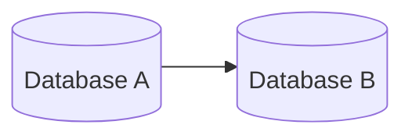
6. Circles
```Markdown
	```mermaid
	graph TD
	boxa(( Normal Box with Text ))
	```
```
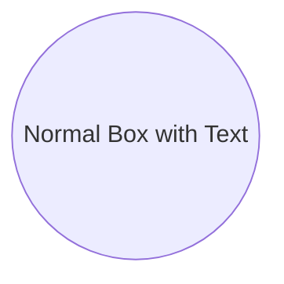

7. Asymmetric Shape
```Markdown
	```mermaid
	graph LR
	boxa>Normal Box with Text]
	```
```
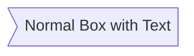
8. Rhombus
```Markdown
	```mermaid
	graph LR
	boxa{Normal Box with Text}
	```
```
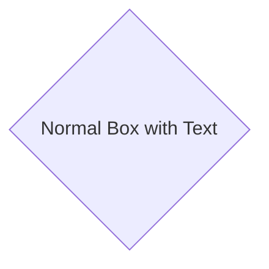
9. Hexagon
```Markdown
	```mermaid
	graph LR
	boxa{{Normal Box with Text}}
	```
```
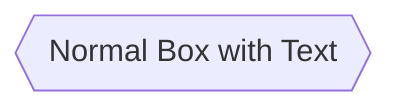
10. Parallelograms
```Markdown
	```mermaid
	graph LR
	boxa[/Normal Box with Text/]
	```
```
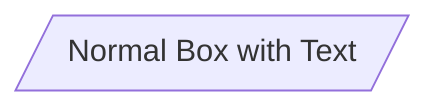
```Markdown
	```mermaid
	graph LR
	boxa[\Normal Box with Text\]	
	```
```
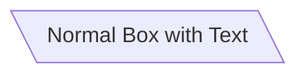
```Markdown
	```mermaid
	graph LR
	boxa[/Normal Box with Text\]	
	```
```
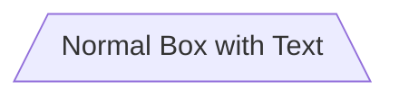
```Markdown
	```mermaid
	graph LR
	boxa[\Normal Box with Text/]	
	```
```
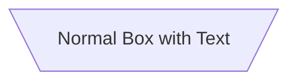

```Markdown
	```mermaid
	graph LR
	boxa[\Normal Box with Text\]	
	```
```
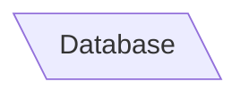

### Links
1. Arrow head
```Markdown
	```mermaid
	graph LR
	A-->B
	```
```
```mermaid
graph LR
A-->B
```

2. Open Link
```Markdown
	```mermaid
	graph LR
	A --- B
	```
```
```mermaid 
graph LR
A --- B
```
3. Text on Link
```Markdown
	```mermaid
	graph LR
	A--Text here-->B
	```
```
```mermaid
graph LR
A--Text here-->B
```
4. Dotted link
```Markdown
	```mermaid
	graph LR
	A-...->B
	```
```
```mermaid
graph LR
A-...->B
```
```Markdown
	```mermaid
	graph LR
	A-.Text here.->B
	```
```
```mermaid
graph LR
A-.Text here.->B
```
5. Thick line
```Markdown
	```mermaid
	graph LR
	A==>B
	```
```
```mermaid
graph LR
A==>B
```
```Markdown
	```mermaid
	graph LR
	A==Text Here==>B
	```
```
```mermaid
graph LR
A==Text here==>B
```
### Gantt Charts

 ```Markdown
	 ```mermaid
	 title Productivity Guru Videos
	 dateFormat DD-MM-YYYY
	 section Obsidian Basics
	 Markdown: al, 04-07-2020, 3d
	 Diagrams: after a1, 07-07-2020, 2d
	 section OtherVideos
	 example Video: 01-07-2020, 5d
	 ```
 ```
 ```mermaid
 gantt
 title Productivity Guru Videos
 dateFormat DD-MM-YYYY
 section Obsidian Basics
 Markdown: a1, 04-07-2020, 3d
 Diagrams: after a1, 07-07-2020, 2d
 section OtherVideos
 example Video: 01-07-2020, 5d
 video2: 07-07-2020, 12d
 section Planning
 phase1: 07-09-2020, 1d  
 ```

## Sequence Diagrams

